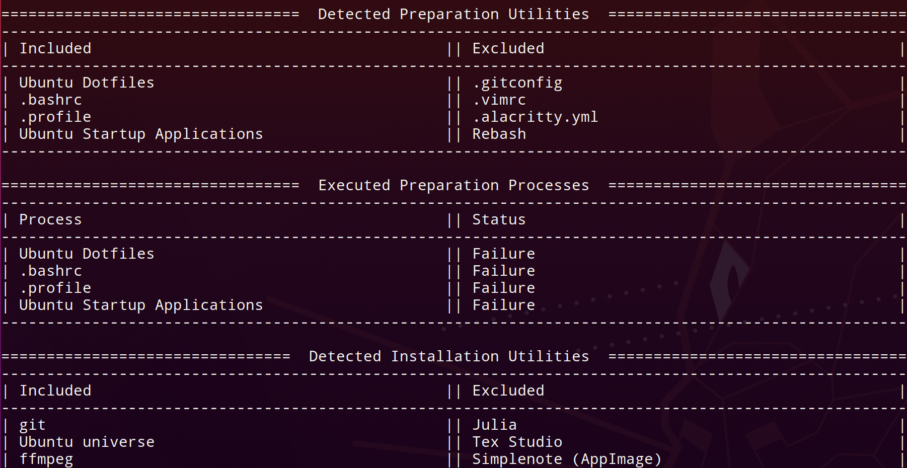

# Autoinstall Manager

Command-line utility to set up a Unix/Linux native system and automatically create symlinks and install programs. Autoinstall-Manager allows users to define installation tasks within a unified Markdown file for ease of use.



## Table of Contents
- [Autoinstall Manager](#autoinstall-manager)
  - [Table of Contents](#table-of-contents)
  - [Installation](#installation)
  - [Usage](#usage)
    - [Setting up Configuration Files](#setting-up-configuration-files)
    - [Managing Settings](#managing-settings)
    - [Running](#running)
      - [Preparation](#preparation)
      - [Installation](#installation-1)
      - [Status Reports](#status-reports)
  - [Tips for Configuration](#tips-for-configuration)
    - [Ordering](#ordering)
    - [Scripting](#scripting)


## Installation

The easiest option is to download the `.deb` file under `releases`. You can install this with one of the following commands:

```bash
sudo apt install autoinstall-manager-<version>.deb # Ubuntu 18.04+
sudo dpkg -i autoinstall-manager-<version>.deb # Debian 9.0+
```

To build it from source, you must have C++11 or newer.
You will also need the C++ boost library installed. On Debian based systems, you can run the command:

```bash
sudo apt-get install libboost-all-dev
```

To install the build, clone this repository and use the Makefile to build from source:

```bash
git clone https://github.com/calvang/autoinstall-manager.git
cd autoinstall-manager
sudo make
```

To uninstall, run:

```bash
sudo make uninstall
```

## Usage

```bash
Usage: autoinstall [OPTIONS]
  -h,  --help       Access help menu
  -v,  --verbose    Output in verbose mode
  -s,  --save       Save output to "~/.config/autoinstall-manager/log.txt"
  -p,  --prepare    Prepare system by setting up directories and symlinks
  -i,  --install    Install utilities and programs to system
  
Default arguments are -vspi
```

Before running this utility, you will need create configuration files for the preparation and installation processes and change the settings at `~/.config/autoinstall-manager/settings.conf` to match the paths to your configuration files. 

### Creating Configuration Files

The main purpose for this utility is to store all program installation commands and file system configurations within files that can be directly transfered onto a new operating system. For this reason, it complements a dotfile system very well.

Both configuration are Github-style Markdown files with the following format:

<pre>
# title
## type 1
- [x] name of program to install
```
shell commands to install program
```
- [ ] name of program to ignore for this run
```
shell commands to install program
```
## type 2
...
</pre>

It is important to keep in mind that the configuration files are read from top to bottom, and are executed in the same order.

Bullet points and paragraphs can be included for each program, as the utility will ignore irrelevant formatting.

### Managing Settings

The `settings.conf` file contains the paths to your configuration files and the directories in which to execute each stage of the utility. This settings file will be located in `~/.config/autoinstall-manager` and should be edited to fit your specific system setup.

### Running

To run Autoinstall Manager with both preparation and installation stages, type:

```bash
autoinstall-manager
```

#### Preparation

The preparation stage is reserved for processes that should be finished before installing programs. This includes tasks such as establishing important symlinks, creating necessary directories, and setting up other necessary system-level configurations.

If there are no such tasks for your use case, you can just leave the preparation configuration file blank or skip directly to installation with the `-i` flag:

```bash
autoinstall-manager -vi
```

If you happen to only want to run preparation, you can do so with the `-p` flag:

```bash
autoinstall-manager -vp
```

#### Installation

The installation stage is meant for automating the processing of downloading and installing any desired programs. Since this is shell-based, only programs that can be installed via CLI can be used with Autoinstall Manager (which is a vast majority of Linux programs and utilities).

#### Status Reports

Status reports are enabled by default or via the verbose (`-v`) flag. The utility is designed to skip any script-generated errors, so this will allow you to observe whether any installations or processes failed.

## Tips for Configuration

### Ordering

- Order the utilities in the configuration files in the order you wish to install them.
- You may need to install core utilities such as git, curl, and wget before you run additional installations as those commands may be needed later.

### Scripting

- Make sure to use stable scripting commands, such as `apt-get` instead of `apt`, as they give more stable output.
- Test your scripts individually before adding them to the configuration file. This utility does not perform any validation on scripts.
- Make sure your scripts handle user input automatically. This means including the `-y` flag on some commands or running the utility as root to avoid repeated password prompts.

One functionality you might need often is the ability to fetch binaries directly from a repository's latest Github release page. I have created a [python script](https://gist.github.com/calvang/c36ae007d899b62ac03766199a19ed5c) that implements this as a CLI utility. 