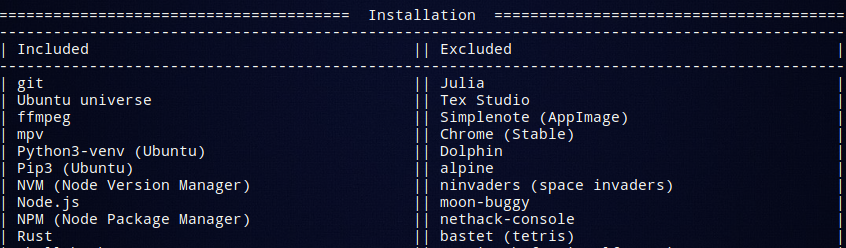

# Autoinstall Manager

Command-line utility to set up a Unix/Linux native system and automatically create symlinks and install programs. Autoinstall-Manager allows users to define installation tasks within a unified Markdown file for ease of use.



## Installation

To install, clone this repository and use the Makefile to build from source:

```bash
git clone https://github.com/calvang/autoinstall-manager.git
cd autoinstall-manager
sudo make
```

To uninstall, run:

```bash
sudo make uninstall
```

## Usage

Before running this utility, you will need create configuration files for the preparation and installation processes and change the settings at `~/.config/autoinstall-manager/settings.conf` to match the paths to your configuration files. 

### Setting up Configuration Files

The main purpose for this utility is to store all program installation commands and file system configurations within files that can be directly transfered onto a new operating system. For this reason, it complements a dotfile system very well.

Both configuration are Github-style Markdown files with the following format:

<pre>
# title
## type 1
- [x] program to install
```
shell commands to install program
```
- [ ] program to ignore for this run
```
shell commands to install program
```
## type 2
...
</pre>

It is important to keep in mind that the configuration files are read from top to bottom, and are executed in the same order.

### Running

To run Autoinstall Manager with both preparation and installation stages, type:

```bash
autoinstall-manager
```

#### Preparation

The preparation stage is reserved for processes that should be finished before installing programs. This includes tasks such as establishing important symlinks, creating necessary directories, and setting up other necessary system-level configurations.

If there are no such tasks for your use case, you can just leave the preparation configuration file blank or skip directly to installation with the `-i` flag:

```bash
autoinstall-manager -vi
```

If you happen to only want to run preparation, you can do so with the `-p` flag:

```bash
autoinstall-manager -vp
```

#### Installation

The installation stage is meant for automating the processing of downloading and installing any desired programs. Since this is shell-based, only programs that can be installed via CLI can be used with Autoinstall Manager (which is a vast majority of Linux programs and utilities).

#### Status Reports

Status reports are enabled by default or via the verbose (`-v`) flag. The utility is designed to skip any script-generated errors, so this will allow you to observe whether any installations or processes failed.